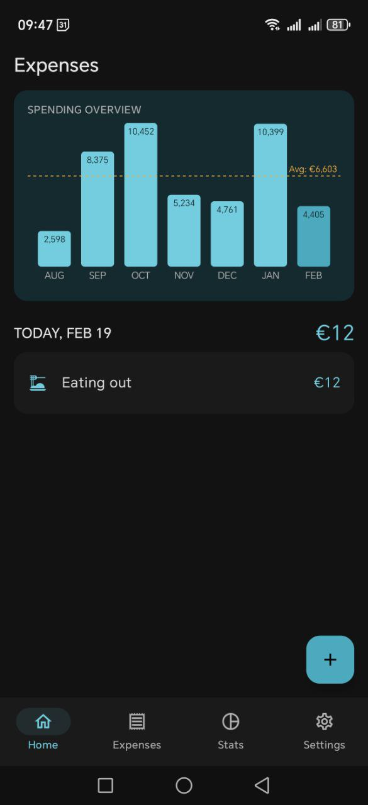
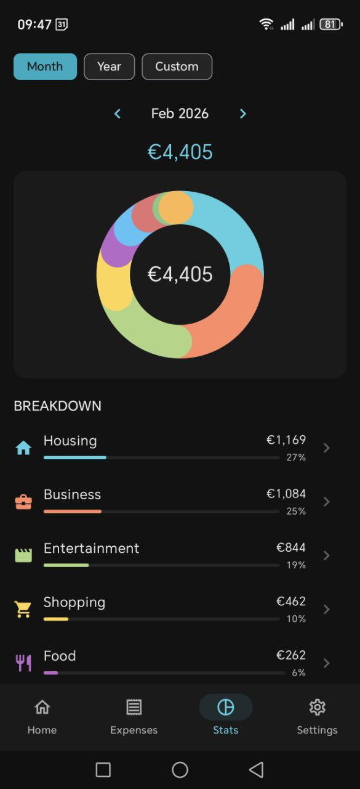

# Expense Tracker

A fast, offline-first Android app for daily expense tracking. Dark theme, no accounts, no cloud — just you and your spending data.

<p align="center">
  
  &nbsp;&nbsp;
  
</p>

## Quick Start

### 1. Install the APK

Download the latest APK from the [Releases](https://github.com/dzhokn/expense-tracker/releases) page.

On your Android device:
1. Open the downloaded `.apk` file
2. Allow installation from unknown sources if prompted
3. Tap **Install**

> Requires Android 9 or newer.

### 2. Load demo data

The app starts empty. To see it in action with sample data:

1. Download [`demo/sample_expenses.csv`](demo/sample_expenses.csv) to your phone
2. Open the app and go to **Settings** (bottom nav, last tab)
3. Tap **Import CSV**
4. Select the downloaded `sample_expenses.csv` file

The demo file contains 46 realistic expenses across categories like Food, Transport, Housing, Health, and more. After import you'll see the home dashboard populated with charts and recent expenses.

### 3. Start tracking

Tap the **+** button on the home screen:
- Enter the amount using the numpad
- Pick a category (tap to drill into subcategories)
- Optionally add a note and change the date
- Tap the checkmark to save

## What's Inside

- **Home** — 6-month spending bar chart, today's expenses, quick add via FAB
- **Expenses** — full history with search, filters (category, date, amount), swipe-to-delete with undo
- **Stats** — donut chart with drill-down, daily/monthly histogram, category breakdown
- **Settings** — CSV import/export, automated nightly backup, category management, home screen widget

All data stays on your device. Nightly backups can be configured to save to any folder on the phone.

## Building from Source

```bash
git clone https://github.com/dzhokn/expense-tracker.git
cd expense-tracker
./gradlew assembleDebug
```

Install the APK via ADB:
```bash
adb install app/build/outputs/apk/debug/app-debug.apk
```

Requires JDK 17 and Android SDK (API 34).

## Tech Stack

Kotlin, Jetpack Compose, Material 3, Room (SQLite + FTS4), Paging 3, WorkManager, Jetpack Glance. MVVM architecture with manual DI. All charts are custom Canvas-drawn.

## License

[MIT](LICENSE)
